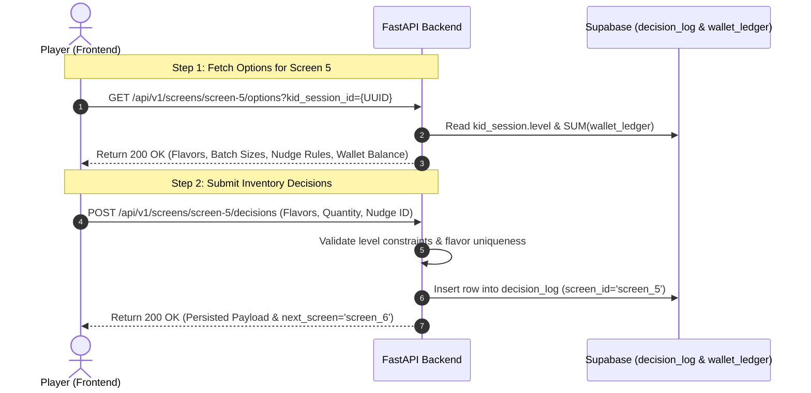

# Screen 5 (Flavor & Quantity Selection) — Endpoint Contract Specification

**Target Implementation Sprint**: Foundation & Core Screens (MOGUL-12 / MOGUL-13 / MOGUL-14)  
**Spec Status**: Finalized Contract (Implementation blocked until DS tables land on Sept 20)  
**Author**: Sudhira  
**Module**: `app/schemas/screen_5.py`  

---

## 1. Overview & Architecture

Screen 5 allows players to configure their lollipop stand inventory by selecting:
1. **Flavors**: 1 to $N$ distinct flavors (constrained by player's `level`).
2. **Quantity**: Batch size option (e.g. 20, 50, 100).
3. **AI Nudge Engine**: Contextual hints surfaced based on selection thresholds.

### Financial Lifecycle
* Screen 5 is **read-only** with respect to the wallet. It displays the live wallet balance, but **no funds are deducted**.
* Actual ingredient/batch deductions take place downstream in **Screen 6 (Prep Level — Buy vs Make)**.



---

## 2. API Endpoints

### 2.1. Get Screen 5 Options
* **Route**: `GET /api/v1/screens/screen-5/options`
* **Auth**: Required (`Authorization: Bearer <session_token>`)
* **Description**: Fetches level-gated flavor catalog, batch quantity options, AI nudge rules, and current read-only wallet balance.

#### Query Parameters:
| Parameter | Type | Required | Description |
| :--- | :---: | :---: | :--- |
| `kid_session_id` | UUID | Yes | Active session ID of the player |

#### Success Response (`200 OK`):
```json
{
  "kid_session_id": "3fa85f64-5717-4562-b3fc-2c963f66afa6",
  "level": 1,
  "wallet_balance_cents": 5000,
  "max_flavors_allowed": 2,
  "flavor_options": [
    {
      "id": "flavor_cherry",
      "name": "Cherry Blast",
      "description": "Sweet and juicy all-time classic",
      "color_hex": "#E63946",
      "icon_url": "https://assets.minimogul.app/flavors/cherry.svg",
      "is_unlocked": true,
      "is_premium": false
    },
    {
      "id": "flavor_blue_raspberry",
      "name": "Blue Raspberry",
      "description": "Tangy and refreshing crowd favorite",
      "color_hex": "#457B9D",
      "icon_url": "https://assets.minimogul.app/flavors/blue_raspberry.svg",
      "is_unlocked": true,
      "is_premium": false
    },
    {
      "id": "flavor_lemon",
      "name": "Lemon Zing",
      "description": "Bright, sunny, and sour citrus flavor",
      "color_hex": "#F4A261",
      "icon_url": "https://assets.minimogul.app/flavors/lemon.svg",
      "is_unlocked": true,
      "is_premium": false
    }
  ],
  "quantity_options": [
    {
      "units": 20,
      "label": "20 Lollipops",
      "tag": "Starter Batch",
      "is_recommended": true
    },
    {
      "units": 40,
      "label": "40 Lollipops",
      "tag": "Standard Batch",
      "is_recommended": false
    },
    {
      "units": 60,
      "label": "60 Lollipops",
      "tag": "Mega Batch",
      "is_recommended": false
    }
  ],
  "nudge_rules": [
    {
      "rule_id": "nudge_l1_high_qty",
      "trigger_type": "high_quantity",
      "trigger_quantity_min": 60,
      "trigger_quantity_max": null,
      "trigger_flavor_count_max": null,
      "copy_text": "Whoa, 60 lollipops is a huge batch! Make sure you save enough money to make them in the next step.",
      "audio_url": null
    },
    {
      "rule_id": "nudge_l1_single_flavor",
      "trigger_type": "low_flavor_variety",
      "trigger_quantity_min": null,
      "trigger_quantity_max": null,
      "trigger_flavor_count_max": 1,
      "copy_text": "Offering 2 flavors gives your customers more choices to love!",
      "audio_url": null
    }
  ],
  "data_source": "mock_fallback"
}
```

---

### 2.2. Submit Screen 5 Decisions
* **Route**: `POST /api/v1/screens/screen-5/decisions`
* **Auth**: Required (`Authorization: Bearer <session_token>`)
* **Description**: Validates choices, checks flavor constraints, and writes decision state to Supabase `decision_log`.

#### Request Body (`application/json`):
```json
{
  "kid_session_id": "3fa85f64-5717-4562-b3fc-2c963f66afa6",
  "selected_flavors": [
    "flavor_cherry",
    "flavor_blue_raspberry"
  ],
  "batch_quantity": 40,
  "nudge_fired_id": "nudge_l1_single_flavor"
}
```

#### Validation Rules:
1. `selected_flavors`: Must contain between `1` and `max_flavors_allowed` unique flavor IDs. Duplicate IDs in the array reject with `422 Unprocessable Entity`.
2. `batch_quantity`: Must match one of the available `units` values for the player's level.
3. `kid_session_id`: Must exist and belong to the authenticated account.

#### Success Response (`200 OK`):
```json
{
  "status": "success",
  "decision_id": "550e8400-e29b-41d4-a716-446655440000",
  "kid_session_id": "3fa85f64-5717-4562-b3fc-2c963f66afa6",
  "screen_id": "screen_5",
  "persisted_payload": {
    "selected_flavors": [
      "flavor_cherry",
      "flavor_blue_raspberry"
    ],
    "flavor_count": 2,
    "batch_quantity": 40,
    "nudge_fired_id": "nudge_l1_single_flavor"
  },
  "next_screen": "screen_6"
}
```

---

### 2.3. Get Existing Screen 5 Decision (State Resume)
* **Route**: `GET /api/v1/screens/screen-5/decisions/{kid_session_id}`
* **Auth**: Required (`Authorization: Bearer <session_token>`)
* **Description**: Returns the latest persisted decision for Screen 5 to support back-navigation or screen refresh.

#### Success Response (`200 OK`):
```json
{
  "has_decision": true,
  "decision_id": "550e8400-e29b-41d4-a716-446655440000",
  "persisted_payload": {
    "selected_flavors": [
      "flavor_cherry",
      "flavor_blue_raspberry"
    ],
    "flavor_count": 2,
    "batch_quantity": 40,
    "nudge_fired_id": null
  },
  "created_at": "2026-09-11T14:32:00Z"
}
```

---

## 3. Error Responses

| HTTP Status | Error Detail Example | Trigger Condition |
| :---: | :--- | :--- |
| `400 Bad Request` | `{"detail": "Invalid quantity 75. Must be one of: [20, 40, 60]"}` | Quantity does not match allowed level options |
| `400 Bad Request` | `{"detail": "Exceeded max allowed flavors (2) for Level 1"}` | Too many flavors selected |
| `401 Unauthorized` | `{"detail": "Invalid or expired token"}` | Missing / invalid Bearer token |
| `404 Not Found` | `{"detail": "Kid session not found"}` | Invalid `kid_session_id` |
| `422 Unprocessable Entity` | `{"detail": "Duplicate flavors cannot be selected in a single batch"}` | Pydantic validator failure |

---

## 4. Frontend Integration Notes

1. **Option Hydration**: Frontend calls `GET /api/v1/screens/screen-5/options?kid_session_id=...` upon screen mount.
2. **Local Nudge Evaluation**: As the player interacts with sliders / checkboxes, the frontend checks the returned `nudge_rules` array to immediately trigger speech bubble copy without round-trip latency.
3. **Commit & Advance**: Upon clicking "Continue", the frontend calls `POST /api/v1/screens/screen-5/decisions` with `nudge_fired_id` (if triggered) and routes to `/screen-6-prep-level` upon `200 OK`.
